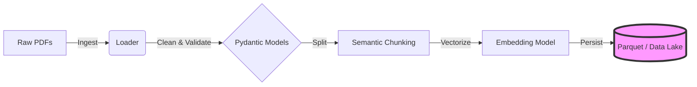

# Enterprise RAG Data Pipeline

## 🎯 The Business Problem: "Dark Data"
Organizations today sit on massive troves of **Unstructured Data** (PDFs, Legal Contracts, Technical Manuals, Research Papers). 
- **80% of enterprise data** is unstructured.
- It is invisible to traditional SQL databases.
- It is inaccessible to analytics tools.

**The Solution:**
This project is an **Automated Data Engineering Pipeline** that transforms this "Dark Data" into a structured, queryable asset. It ingests raw PDFs, intelligently chunks them based on semantic context, generates vector embeddings, and persists the result in a silver-layer storage format (Parquet) ready for High-Performance Retrieval (RAG).

---

## 🏗 System Architecture

The pipeline implements a modular ETL flow designed for maintainability and scale.



### Key Engineering Features
- **Modular Design**: Decoupled Ingestion, Processing, and Storage layers.
- **Data Quality**: Enforced via `Pydantic` schemas to ensure no bad data moves downstream.
- **Observability**: Detailed logging for every stage of the pipeline.
- **Scalability**: Stateless architecture that can be deployed on Airflow or Kubernetes.

---

## 🛠 Tech Stack
- **Language**: Python 3.10+
- **Data Validation**: Pydantic
- **Processing**: LangChain / Pandas 2.0
- **Storage**: Apache Parquet / PyArrow
- **Infrastructure**: Make / VirtualEnv

---

## 🚀 How to Run

### 1. Setup
Initialize the isolated environment and dependencies.
```bash
make setup
```

### 2. Ingest Data (ETL Run)
Run the full ingestion pipeline. This process will:
1. Scan `Data/` for new documents.
2. Chunk them into 1000-character segments.
3. Generate 768-dimensional vector embeddings.
4. Save the result to `output/embeddings.parquet`.
```bash
make run
```

### 3. Verify Business Value (Demo)
Inspect the structured output that was generated. This proves the data is now ready for consumption by Vector DBs or LLMs.
```bash
make demo
```

---

## 📂 Project Structure

```
├── Data/                   # Raw input documents (The "Source")
├── output/                 # Processed Parquet files (The "Asset")
├── src/
│   ├── config/            # Configuration management
│   ├── ingestion/         # PDF loading & metadata extraction
│   ├── processing/        # Text splitting logic
│   ├── embedding/         # Vector generation interface
│   ├── storage/           # Data persistence layer
│   └── demo/              # Demonstration scripts
├── main.py                # Pipeline Orchestrator
├── Makefile               # Command runner
└── requirements.txt       # Dependencies
```

## Future Improvements
- [ ] Connect to Weaviate/Pinecone for Vector DB storage.
- [ ] Implement Airflow DAGs for scheduled ingestion.
- [ ] Add Docker containerization for deployment.
