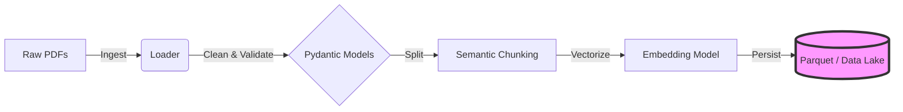

# Enterprise RAG Data Pipeline

## 🎯 The Business Problem: "Dark Data"
Organizations today sit on massive troves of **Unstructured Data** (PDFs, Legal Contracts, Technical Manuals, Research Papers). 
- **80% of enterprise data** is unstructured.
- It is invisible to traditional SQL databases.
- It is inaccessible to analytics tools.

**The Solution:**
This project is an **Automated Data Engineering Pipeline** that transforms this "Dark Data" into a structured, queryable asset. It ingests raw PDFs, intelligently chunks them based on semantic context, generates vector embeddings, and persists the result in a silver-layer storage format (Parquet) ready for High-Performance Retrieval (RAG).

---

## 🏗 System Architecture

The pipeline implements a modular ETL flow designed for maintainability and scale.


```mermaid
graph LR
    A[Raw PDFs] -->|Ingest| B(Loader)
    B -->|Clean & Validate| C{Pydantic Models}
    C -->|Split| D[Semantic Chunking]
    D -->|Vectorize| E[Embedding Model]
    E -->|Persist| F[(Parquet / Data Lake)]
    style F fill:#f9f,stroke:#333,stroke-width:4px
```

### Key Engineering Features
- **Modular Design**: Decoupled Ingestion, Processing, and Storage layers.
- **Advanced Chunking**: Strategy Pattern implementation supporting:
    - `structural`: Intelligent recursive splitting for PDFs (headers/paragraphs).
    - `sliding`: Word-based sliding window for Audio/Transcripts.
    - `fixed`: Standard fixed-size character splitting.
- **Data Quality**: Enforced via `Pydantic` schemas to ensure no bad data moves downstream.
- **Observability**: Detailed logging for every stage of the pipeline.
- **Scalability**: Stateless architecture that can be deployed on Airflow or Kubernetes.

---

## 🛠 Tech Stack
- **Language**: Python 3.10+
- **Data Validation**: Pydantic & Great Expectations (Data Contracts)
- **Processing**: LangChain, PyPDF, Tesseract (OCR)
- **Storage**: Qdrant Vector DB (Hybrid Dense+Sparse Search) & Apache Parquet
- **Orchestration**: Apache Airflow
- **Streaming**: Redpanda (Kafka compatible) publish-subscribe
- **API/Serving**: FastAPI
- **Infrastructure**: Terraform, Docker, Make, Pytest

---

## 🚀 How to Run

### 1. Setup Infrastructure
Start the Qdrant Vector DB via Docker:
```bash
make infra-up
```

### 2. Setup Environment
Initialize the isolated environment and dependencies.
```bash
make setup
```

### 3. Ingest Data (ETL Run)
Run the full ingestion pipeline to process PDFs and upsert vectors into Qdrant.
```bash
make run
```

### 4. Serve the Data (API)
Start the FastAPI server to query the pipeline results:
```bash
make api
```
Then visit `http://localhost:8888/docs` to test semantic search.

### 5. Chat with the Data (Streamlit UI)
Once the API is running, you can open a beautiful Chat interface that talks to your Data Lake:
```bash
make ui
```


### 6. Configuration & Offline Mode
This pipeline supports both **Local** (Offline) and **Online** embedding modes.
Edit the `.env` file to configure:

```bash
# `hybrid` (Best for Qdrant RAG) | `huggingface` (Dense only) | `mock` (Offline testing limits downloads)
EMBEDDING_TYPE=hybrid
# Model name config (Will download weights on first startup ~400MB if using Huggingface/Hybrid)
EMBEDDING_MODEL_NAME=all-mpnet-base-v2
# CHUNKING STRATEGY
CHUNKING_STRATEGY=structural
# `qdrant` (Live search) | `parquet` (Offline static file sink)
STORAGE_TYPE=qdrant
```

Note: If running in a strictly isolated or offline environment, switch `EMBEDDING_TYPE='mock'` and `STORAGE_TYPE='parquet'`. These eliminate external HTTP HuggingFace model fetching and database networking requirements.

### 7. Run Automated Tests
```bash
make test
```

---

## 📂 Project Structure

```
├── Data/                   # Raw input documents
├── output/                 # Processed Parquet files
├── src/
│   ├── config/            # Env and centralized settings
│   ├── ingestion/         # PDF & Image OCR loading
│   ├── processing/        # Intelligent chunking strategies
│   ├── embedding/         # Vector generation (Dense, Mock, Hybrid)
│   ├── storage/           # Data contracts (GE) and persistence (Qdrant/Parquet)
│   ├── api/               # FastAPI retrieval service
│   ├── ui/                # Streamlit chat interface
│   ├── streaming/         # Real-time Redpanda Event consumers
│   └── demo/              # Demonstration scripts
├── terraform/             # Zero-cost local Infrastructure as Code (IaaC)
├── main.py                # Batch Pipeline Orchestrator
├── Makefile               # Task runner
└── requirements.txt       # Dependencies
```

## Future Improvements (P1/P2/P3 Roadmap)
- [ ] Implement robust CI Pipeline (Ruff Linting, Mypy, test gates).
- [ ] Migrate storage to batched upserts with exponential backoff & dead-letter queue semantics for Kafka.
- [ ] Reranking architecture & retrieval quality eval program (MRR/nDCG).
- [ ] Multi-tenant API security (RBAC/API Keys) & rate-limiting bounds.
